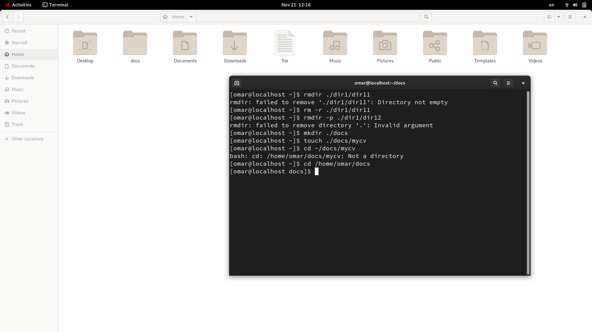
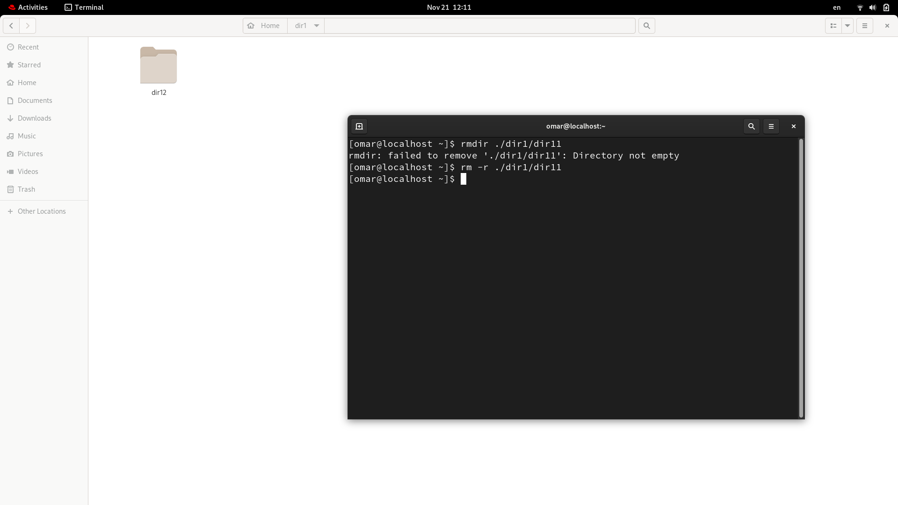
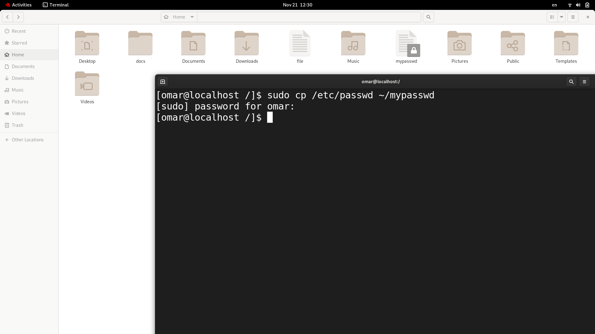
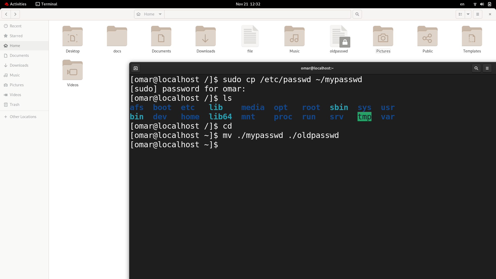
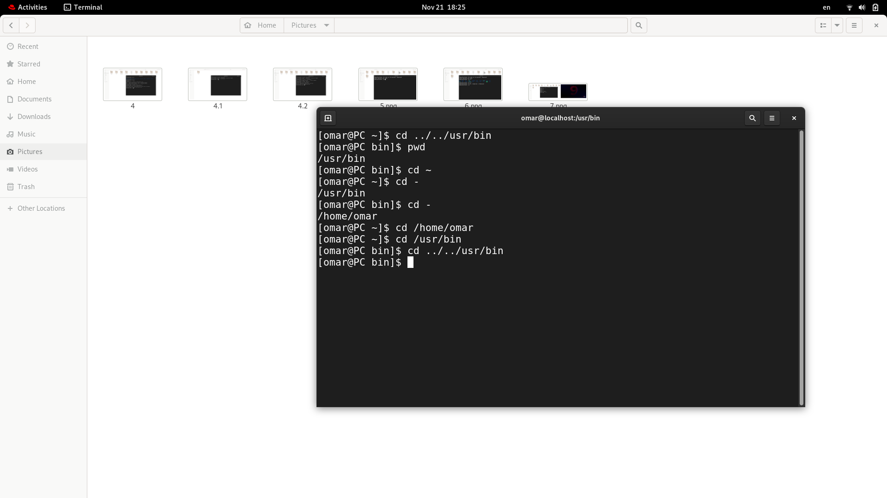
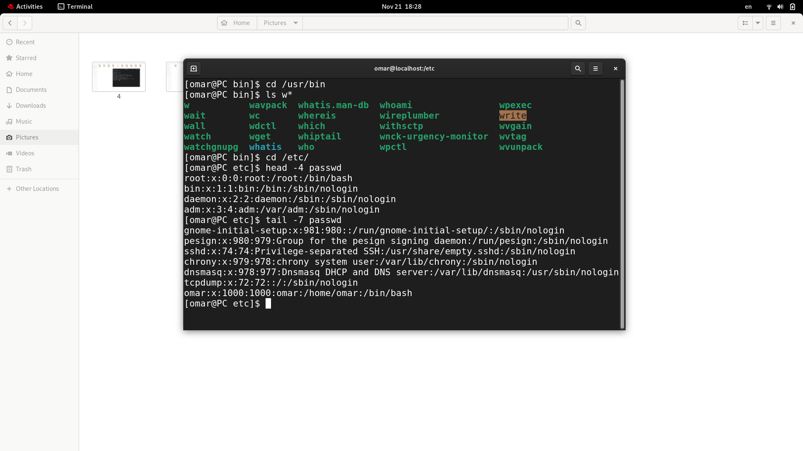

# Lab [1]

## 1- Install RedHat ?
##### Done !

## 2- What is the difference between ***cat*** and ***more*** ?
##### 

## 3- What is the difference between ***rm*** and ***rmdir*** ?
##### 

## 4- Create the following hierarchy under your home directory?

# 5- Copy the /etc/passwd file to your home directory making its name is mypasswd.
##### using command : cp ~/etc/passwd ~/mypasswd

# 6- Rename this new file to be oldpasswd.  
###### using command : cp ~/mypasswd ~/odlpasswd

# 7 - You are in /usr/bin, list four ways to go to your home directory.
###### using following commands : 
cd ~
cd 
cd /home
cd ../../home

# 8 , 9 , 10 -Using commands :
8- cd /usr/bin 
   ls w*
9- head -4 /etc/passwd
10- tail -7 /etc/passwd

