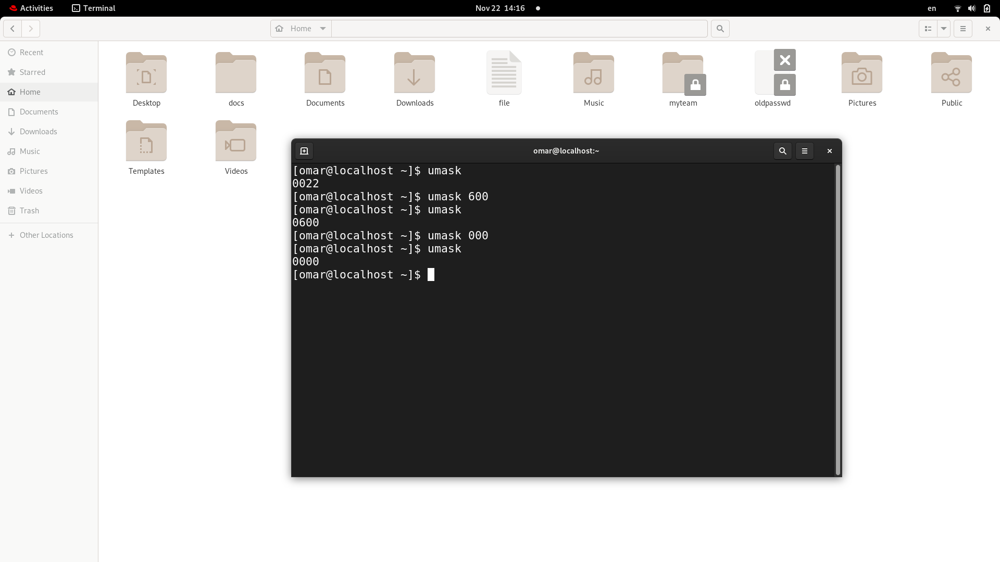
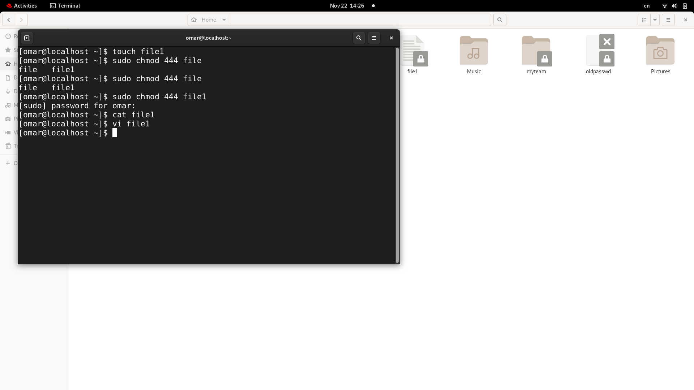

# Lab [2]

## 1- Create user Islam.
adduser -c "Islam Askar" -md /home/islam islam
tail -1 /etc/passwd
passwd islam
islam

## 2- Create user baduser.
adduser -c "Bad User" -md /home/baduser baduser
tail -1 /etc/passwd
passwd baduser
baduser

## 3. Create a supplementary (Secondary) group called pgroup with group ID of 30000.
## 4. Create a supplementary group called badgroup.
## 5. Add islam user to the pgroup group as a supplementary group.
#### commands:
3- sudo groupadd -g 30000 pgroup
   tail -1 /etc/group

4- sudo groupadd badgroup
   tail -1 /etc/group

5- sudo usermod -G pgroup islam
   tail -1 /etc/group

## 6. Modify the password of islam's account to password
## 7. Modify islam's account so the password expires after 30 days
## 8. Lock bad user account so he can't log in
#### commands:
6- sudo passwd islam 
   password

7- sudo chage -m 30 islam

8- sudo passwd -l baduser

## 9. Delete bad user account
## 10. Delete the supplementary group called badgroup.
#### commands:
9- sudo userdel baduser

10- sudo groupdel badgroup

## 13. Create a folder called myteam in your home directory and change its permissions to read only for the owner.

## 14. Log out and log in by another user
## 15. Try to access (by cd command) the folder (myteam)

## 16- Using the command Line
### - Change the permissions of oldpasswd file to give owner read and write
### permissions and for group write and execute and execute only for the others
### (using chmod in 2 different ways)
### - Change your default permissions to be as above.
### - What is the maximum permission a file can have, by default when it is just
### created? And what is that for directory.
### - Change your default permissions to be no permission to everyone then create a
### directory and a file to verify.

## 18. Create a file with permission 444. Try to edit in it and to remove it? Note what happened.

## 19. What is the difference between the “x” permission for a file and for a directory?
### File : it's a permission to execute a file that does scripts
### Directory : it's a permission to enter directory and use command cd on it

   
