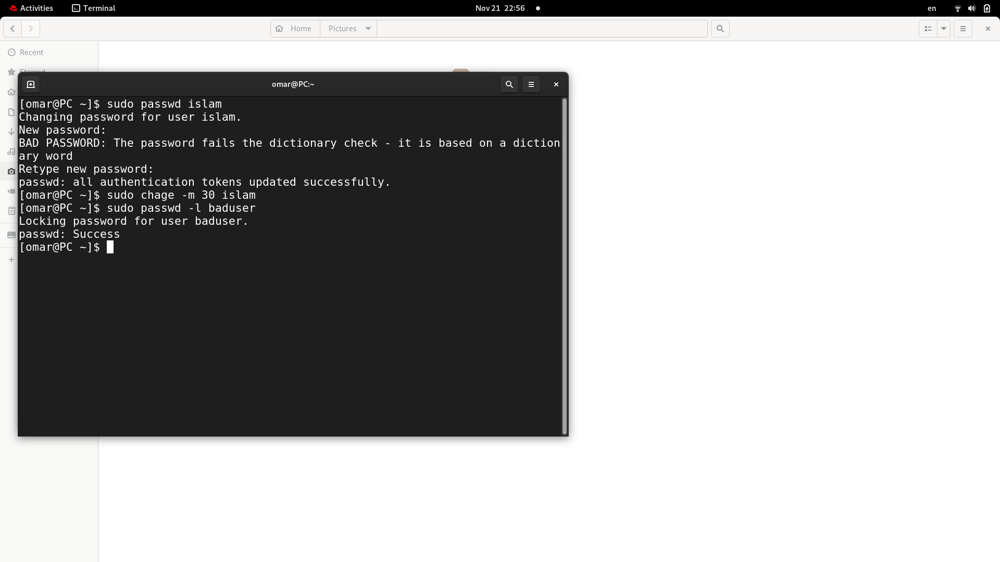

# Lab [2]

## 1- Create user Islam.
adduser -c "Islam Askar" -md /home/islam islam
tail -1 /etc/passwd
passwd islam
islam

## 2- Create user baduser.
adduser -c "Bad User" -md /home/baduser baduser
tail -1 /etc/passwd
passwd baduser
baduser

## 3. Create a supplementary (Secondary) group called pgroup with group ID of 30000.
## 4. Create a supplementary group called badgroup.
## 5. Add islam user to the pgroup group as a supplementary group.
#### commands:
3- sudo groupadd -g 30000 pgroup
   tail -1 /etc/group

4- sudo groupadd badgroup
   tail -1 /etc/group

5- sudo usermod -G pgroup islam
   tail -1 /etc/group

## 6. Modify the password of islam's account to password
## 7. Modify islam's account so the password expires after 30 days
## 8. Lock bad user account so he can't log in
#### commands:
6- sudo passwd islam 
   password

7- sudo chage -m 30 islam

8- sudo passwd -l baduser

## 9. Delete bad user account
## 10. Delete the supplementary group called badgroup.
#### commands:
9- sudo userdel baduser

10- sudo groupdel badgroup

   
