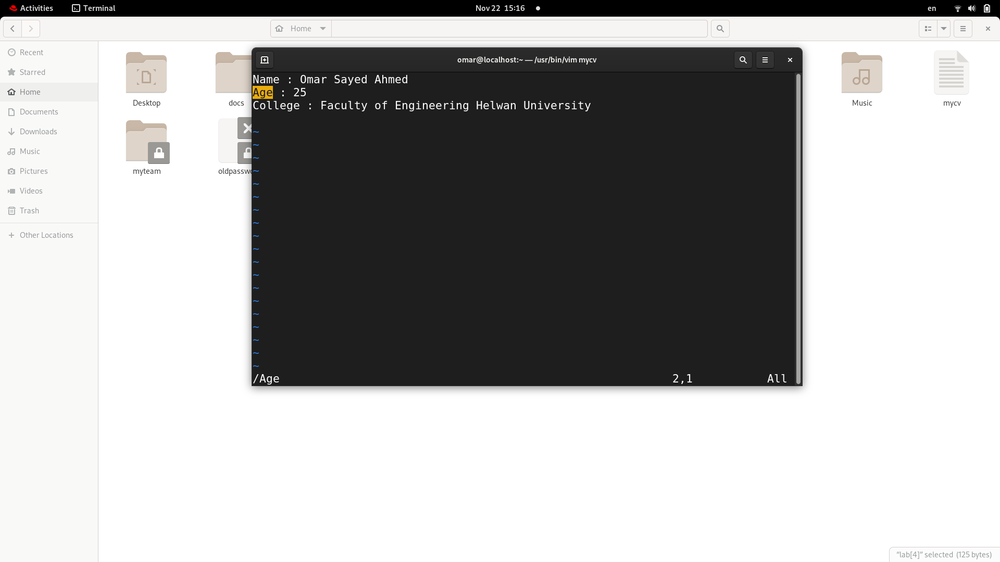
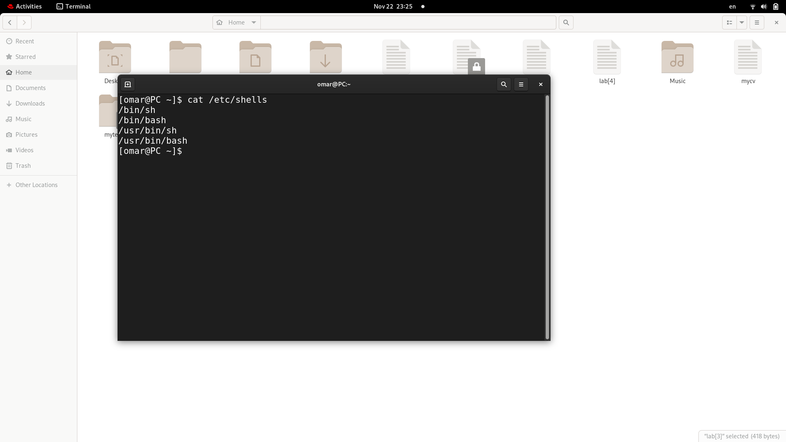
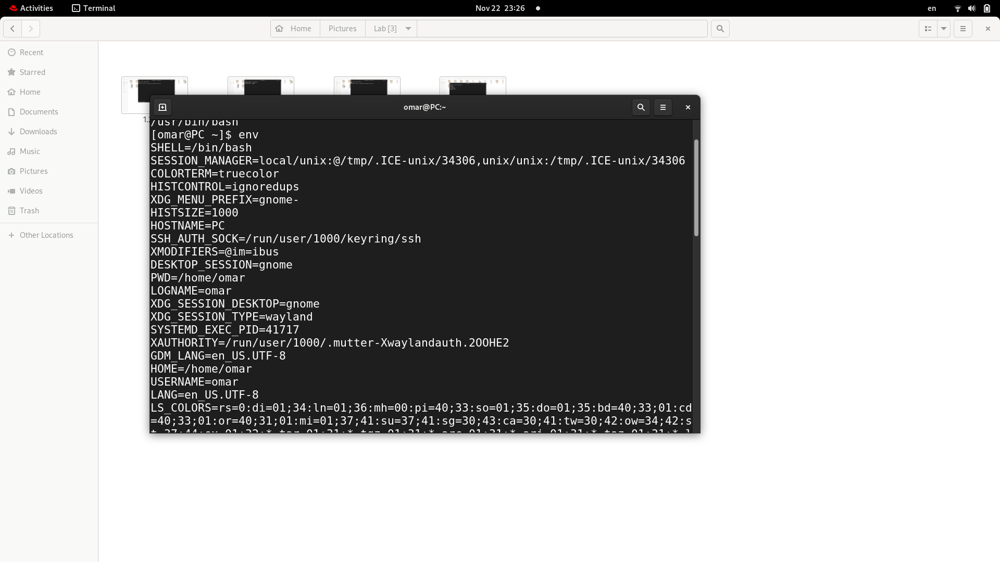
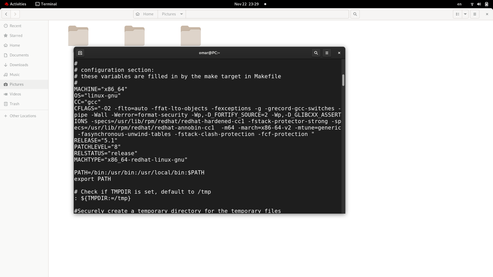
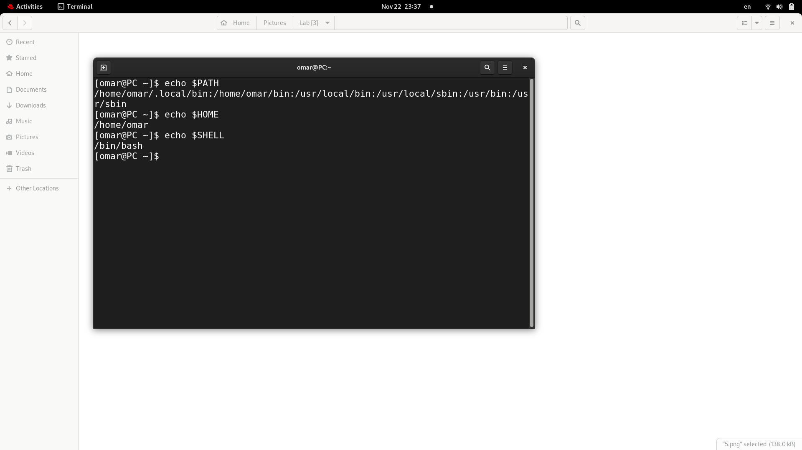
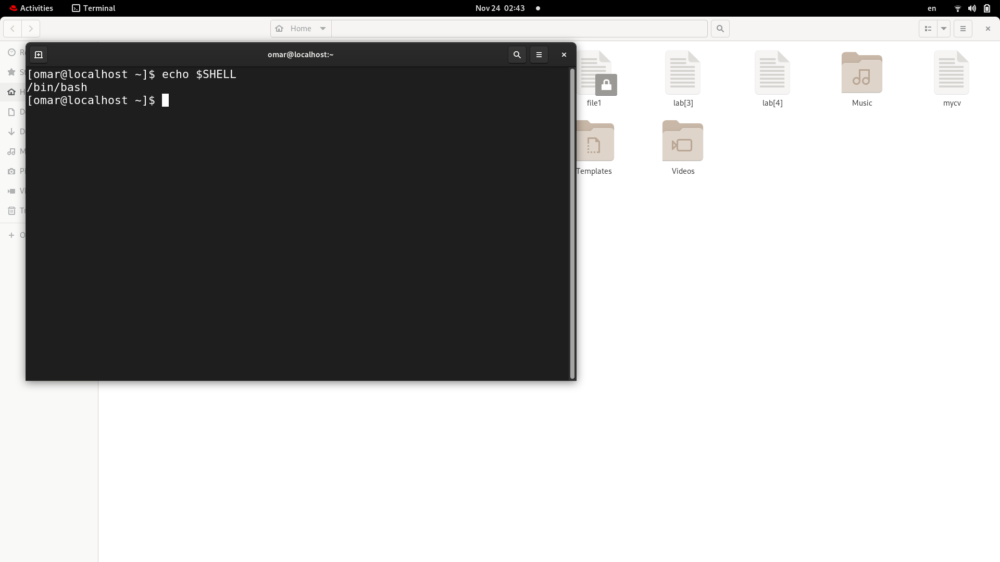
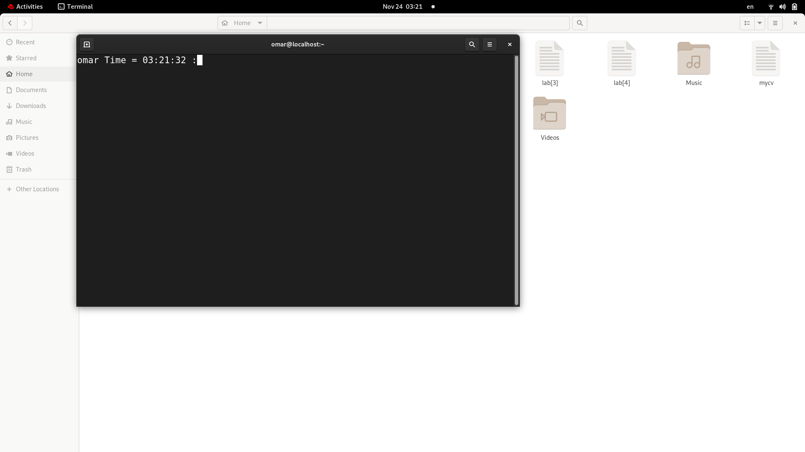
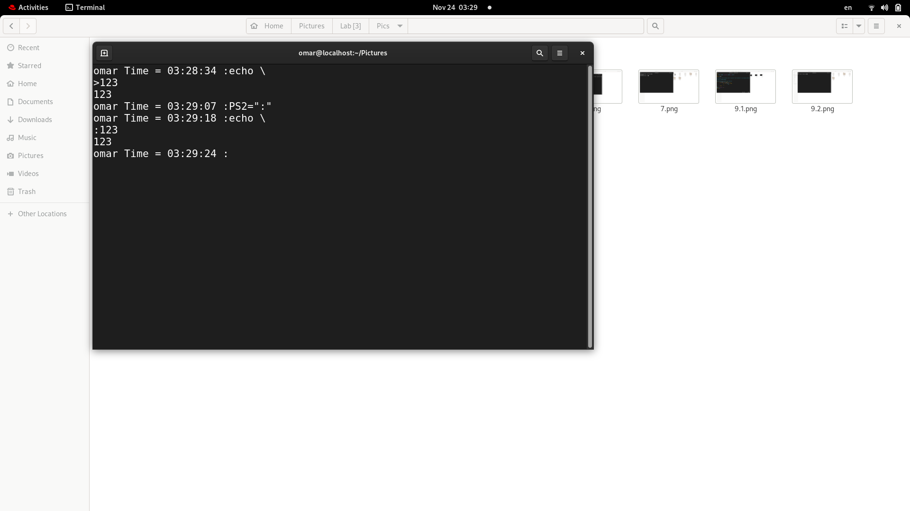
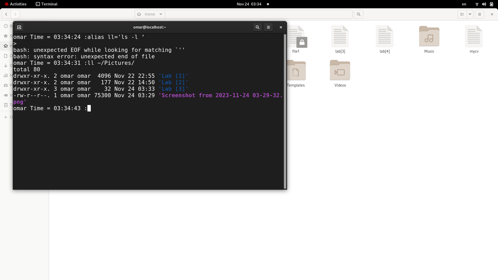

# Lab [3]

# 1. Using vi write your CV in the file mycv. Your CV should include your name, age, school

# 2. Open mycv file using vi command then: Without using arrows state how to:
## a. Move the cursor down one line at time.
## b. Move the cursor up one line at time.
## c. Search for word age
## d. Step to line 5 (assuming that you are in line 1 and file is more than 5 lines).
## e. Delete the line you are on and line 5.
## f. How to step to the end of line and change to writing mode in one-step.

### a)j -> go up 
### b) k -> go down   
### c) /Age
### d) :5 or 5G
### e) :3,5d
### f) A  

# 3. List the available shells in your system.

# 4. List the environment variables in your current shell.

# 5. List all of the environment variables for the bash shell.

# 6. What are the commands that list the value of a specific variable?

# 7. Display your current shell name.

# 8. State the initialization files of: sh, ksh, bash.
- sh:

global initialization file: /etc/profile

Logged-in initialization file: ~/.profile

- ksh:

global initialization file: /etc/profile

logged-in initialization file: ~/.profile

additional logged initialization file for ksh: ~/.kshrc

bash:

global configuration files:

/etc/profile

/etc/bashrc (non-login shells)

logged in user configuration files:

~/.bash_profile, ~/.bash_login, or ~/.profile

~/.bashrc (non-login shells)

# 9. Edit in your profile to display date at login and change your prompt permanently.
![Q9].1(./Pics/9.1.png)

# 10.Execute the command echo \:
## Allows us to write seperate line to print 

# 11.Create a Bash shell alias named ls for the “ls –l” command.

