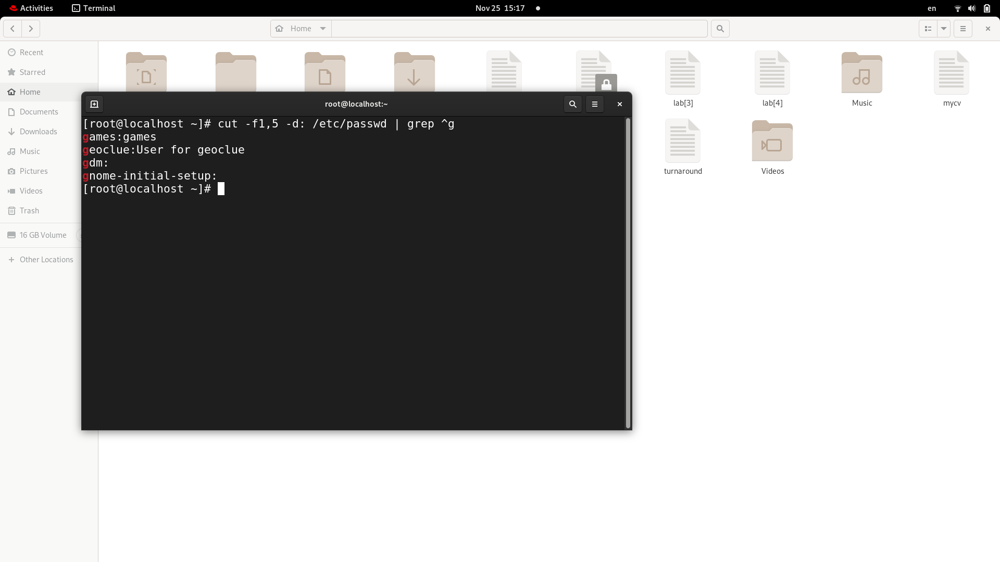
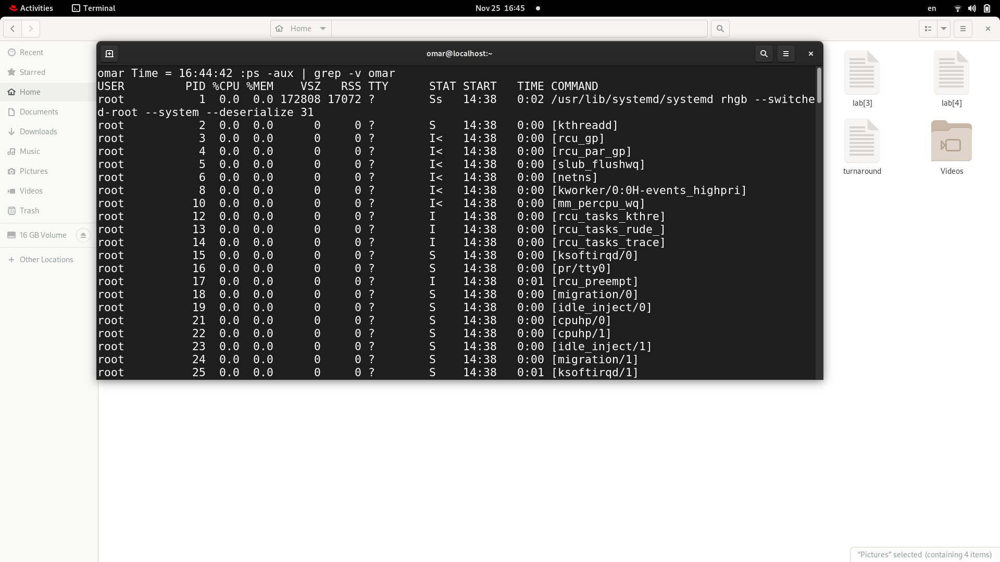

# Lab [4]

# 1. List the user commands and redirect the output to /tmp/commands.list
ls /usr/bin > /tmp/commands.list

# 2. Count the number of user commands
cat /tmp/commands.list | wc -l

# 3. Get all the users names whose first character in their login is ‘g’.
cat /etc/passwd | grep ^g

# 4. Get the logins name and full names (comment) of logins starts with “g”.
cut -f1,5 -d: /etc/passwd | grep ^g

# 5. Save the output of the last command sorted by their full names in a file.
sort -t : -k5 /etc/passwd | cut -f1,5 -d: /etc/passwd | grep ^g > ~/file

# 6. Write two commands: first: to search for all files on the system that named .bash_profile. Second: sorts the output of ls command on / recursively, Saving their output and error in 2 different files and sending them to the background.
sudo ls -r | find / -name .bash_profile > ~/file 2>~/error.file &

# 7. Display the number of users who is logged now to the system.
ps -u

# 8. Display lines 7 to line 10 of /etc/passwd file
head /etc/passwd | tail -3

# 9. What happens if you execute:
## cat filename1 | cat filename2
prints filename2 content only
## ls | rm
Error
## ls /etc/passwd | wc –l
ls /etc/passwd | wc -l
prints 1 as passwd is already a file not directory and line count of the result in first command is 1

# 10.Issue the command sleep 100.
# 11.Stop the last command.
# 12.Resume the last command in the background
# 13.Issue the jobs command and see its output.
# 14.Send the sleep command to the foreground and send it again to the background.
# 15.Kill the sleep command.
sleep 100
ctrl+z
kill -CONT %1
jobs

# 16.Display your processes only
ps -u omar

# 17.Display all processes except yours
ps -aux | pgrep -v omar

# 18.Use the pgrep command to list your processes only
pgrep -u omar

# 19.Kill your processes only.
pkill -U 1000
