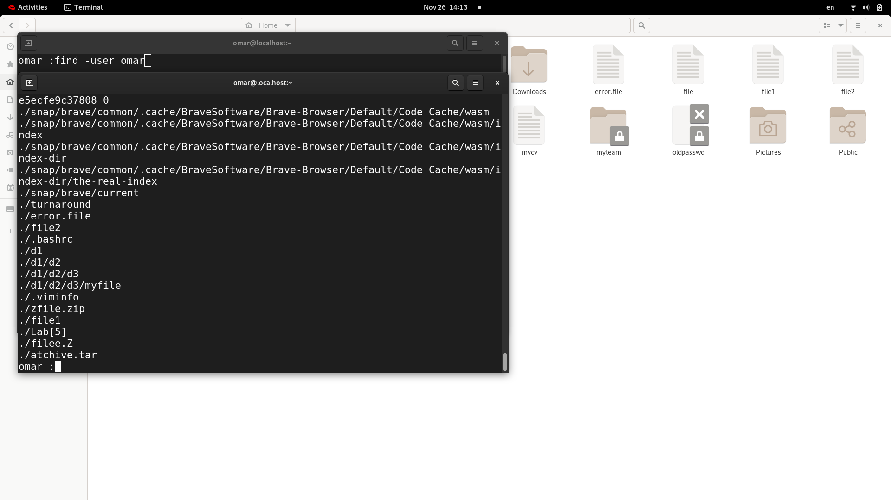

# Lab [5]
## 1. Compress a file by compress, gzip, zip commands and decompress it again. State the differences between compress and gzip commands.
  - compress:
    compress -v filee
    uncompress -v filee
    
  - gzip:
    gzip -v filee
    gunzip -v filee.gz
    
  - zip
    zip -v zfile.zip filee file1 
    unzip zfile.zip

## 2. What is the command used to view the content of a compressed file.
   zcat filee.Z
   unzip -l zfile.zip

## 3. Backup /etc directory using tar utility.
    sudo tar -cvf atchive.tar /etc

## 4. Starting from your home directory, find all files that were modified in the last two day.
    find ./ -mtime -2

## 5. Starting from /etc, find files owned by root user.
   find -user omar

## 6. Find all directories in your home directory.
   find / 
   or 
   locate /  

## 7. Write a command to search for all files on the system that, its name is “.profile”. 
  locate .profile

## 8. Identify the file types of the following: /etc/passwd, /dev/pts/0, /etc, /dev/sda
  file /etc/passwd
  file /dev/pts/0
  file /etc
  file /dev/sda

## 9. List the inode numbers of /, /etc, /etc/hosts.
  ls -i /
  ls -i /etc
  ls -i /etc/hosts

## 10. Copy /etc/passwd to your home directory, use the commands diff and cmp, and Edit in the file you copied, and then use these commands again, and check the output.
  ls -s /etc/passwd /boot/passlink

## 11. Create a symbolic link of /etc/passwd in /boot.
  

## 12. Create a hard link of /etc/passwd in /boot. Could you? Why?
can't create hard link as the directories are in different partitions.

